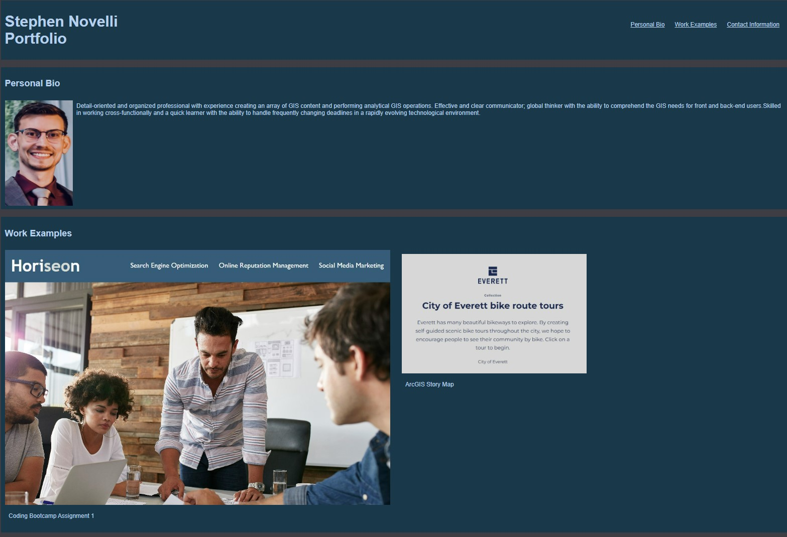
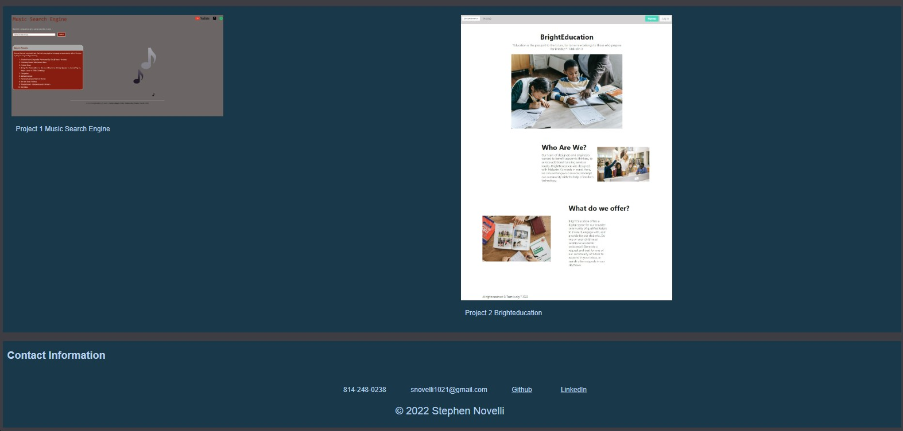

UW Coding Bootcamp Assignment 1- Advanced CSS Challenge: Professional Portfolio

Creating the HTML and CSS from scratch for my professional portfolio. Utalizes the box model and media queries to display content at different pixel widths.

Github Pages:
https://snovelli1021.github.io/snPortfolio/

Github Repo:
https://github.com/snovelli1021/snPortfolio

